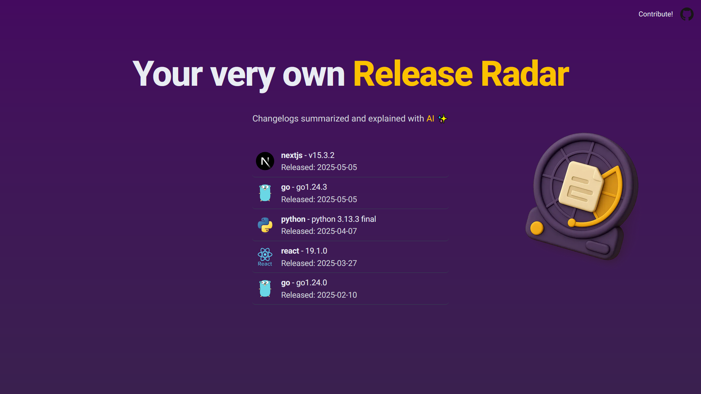

# Release Radar 

## Motivation 🔥
I built this app because I couldn't find a reliable place to keep up with the releases of all the programming languages and frameworks I use. Most official change logs are too technical, especially for people who are just learning to code. My goal was to simplify these updates and present them as quick, easy-to-read summaries so everyone can stay informed without feeling overwhelmed.

## Tech stack ⚙️
- Frontend
-- Next.js
-- Supabase
-- Vercel
- Web Scrapers
-- Python
-- My own VPS for deployment and scheduling

## Contribution Guide
I've never really made or contributed to an open source project before but I think by default GitHub does the following

1. Fork the repository.
2. Create a new branch for your feature or bug fix.
3. Commit your changes with clear messages.
4. Push to your fork and open a Pull Request.
5. Wait for review and feedback.

Make sure your code follows the style used in the project & Thanks for your interest in contributing!

